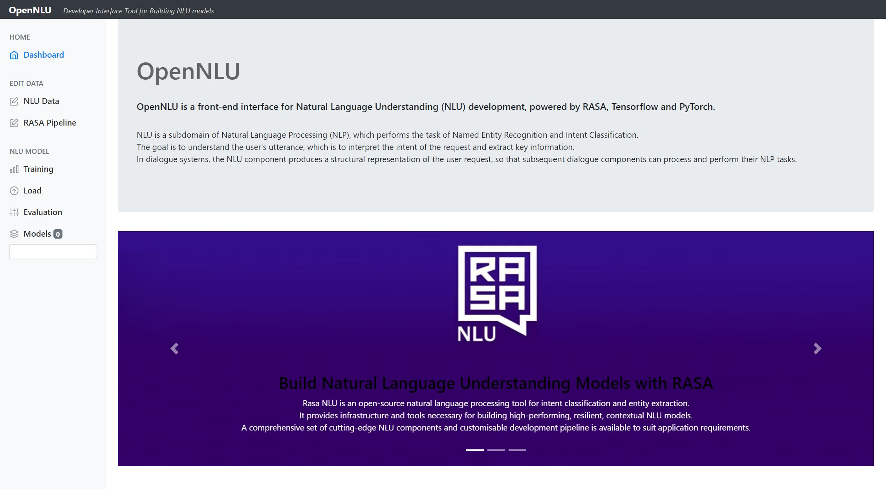
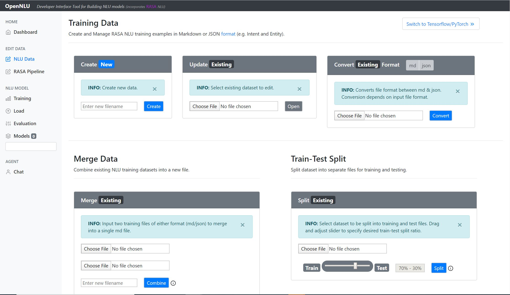
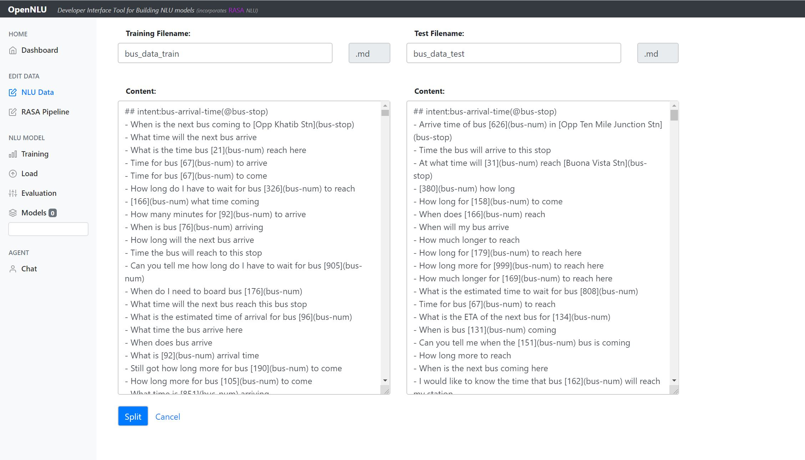
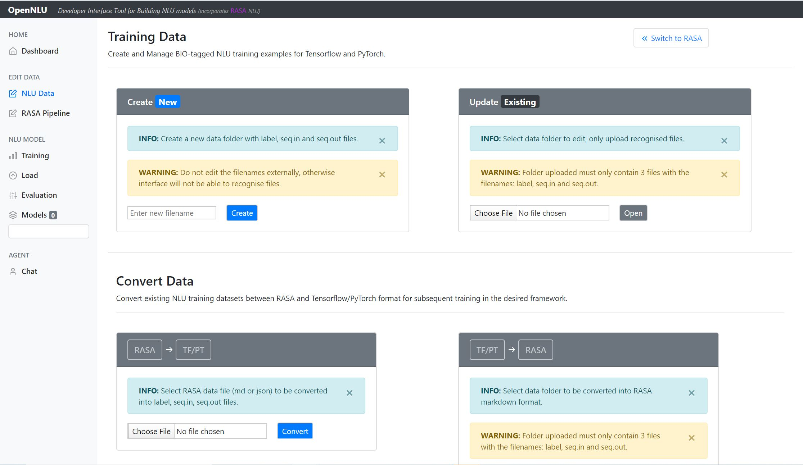
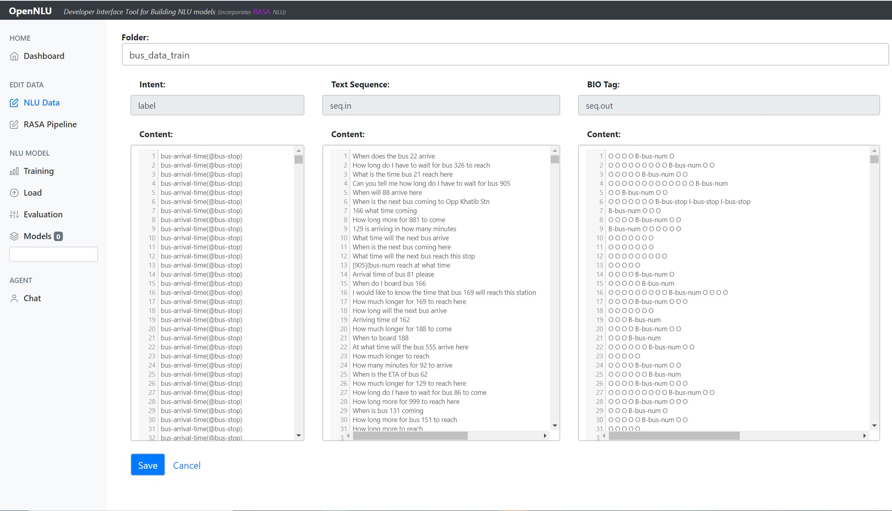
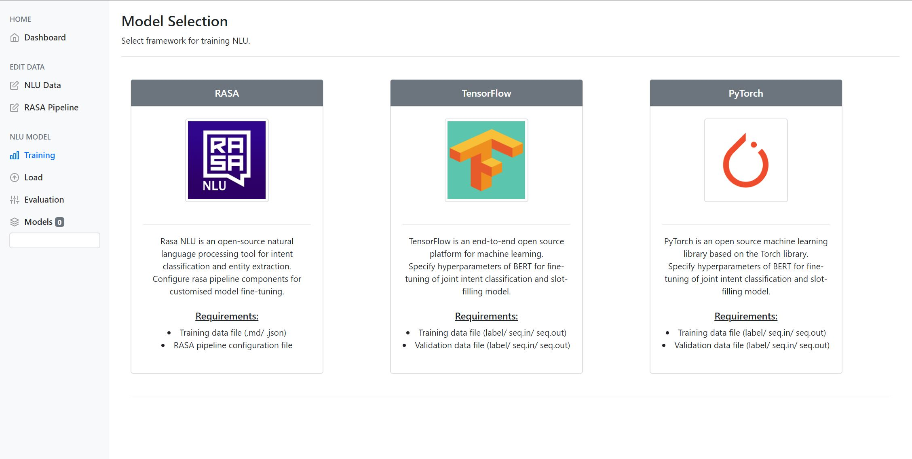
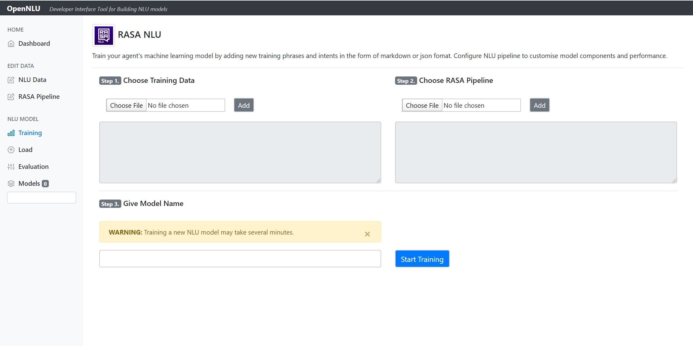
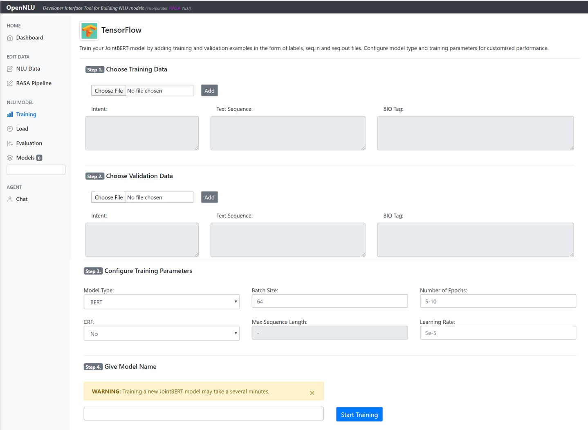
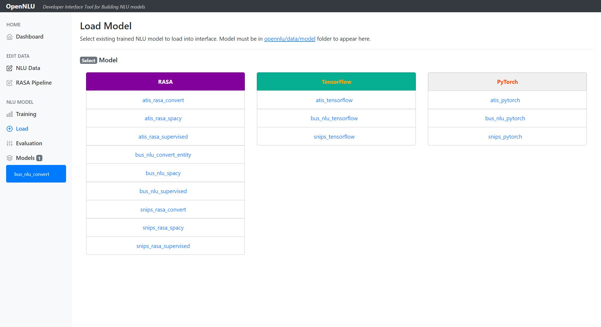
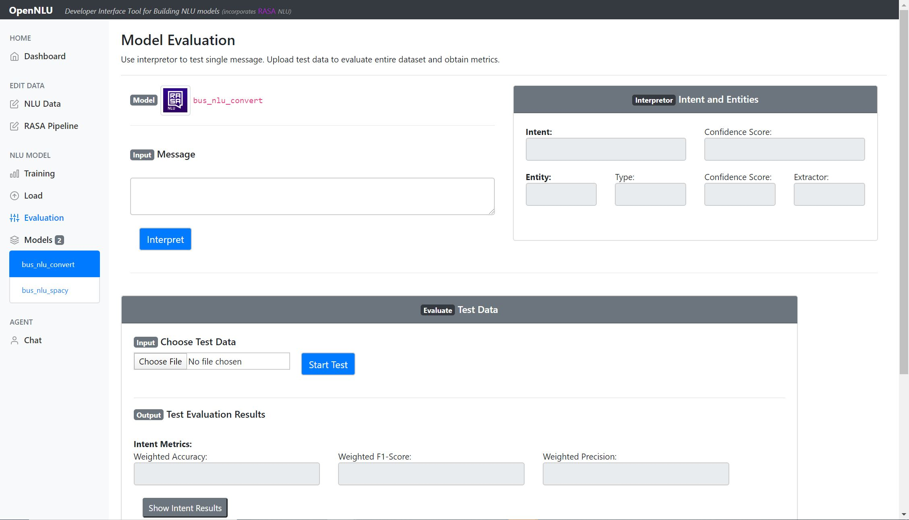

# OpenNLU

OpenNLU is a front-end interface for Natural Language Understanding (NLU) development, powered by RASA, Tensorflow and PyTorch.



## Features

- Data Management
  - Editor for MD, JSON files (intents, entities) in Rasa format
  - Editor for labels, seq.in, seq.out files in Goo et al format
  - Conversion between the two above formats
  - Split dataset
  - Merge dataset
  
  
  
  
  
  
  
  
  
- Training
  - Train Rasa models
  - Train BERT model for Joint Intent Classification and Slot Filling (Tensorflow / PyTorch)
  
  
  
  
  
  
  
- Load
  - Loads trained models (including models trained outside of OpenNLU)
  
  
  
- Evaluation
  - Metrics: acc, f1, recall, precision
  - Intent Confusion Matrix
  - Confidence Histogram
  
  
  
- Predict
  - Return metrics and prediction for single sentence

## Run

```bash
$ python3 run.py
```

## Credits for Tensorflow, PyTorch backend implementation

- [dialog-nlu](https://github.com/MahmoudWahdan/dialog-nlu)
- [JointBERT](https://github.com/monologg/JointBERT)
